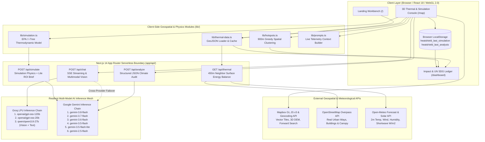
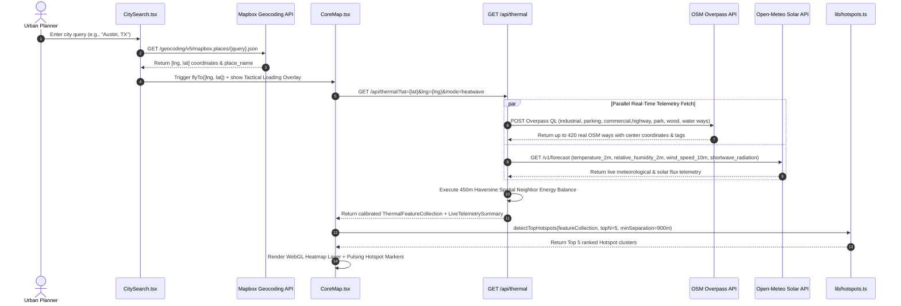
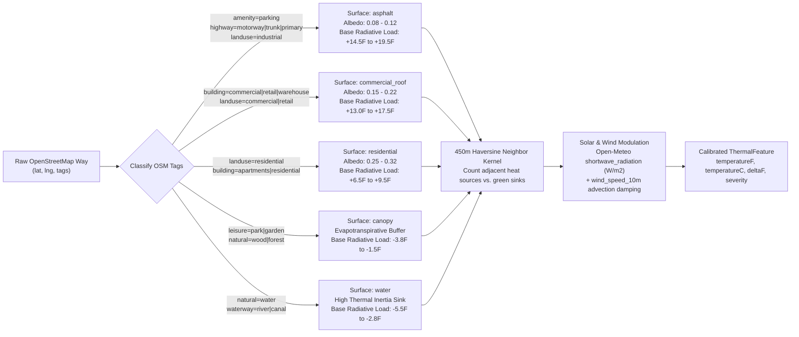
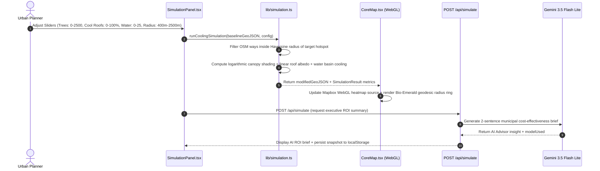
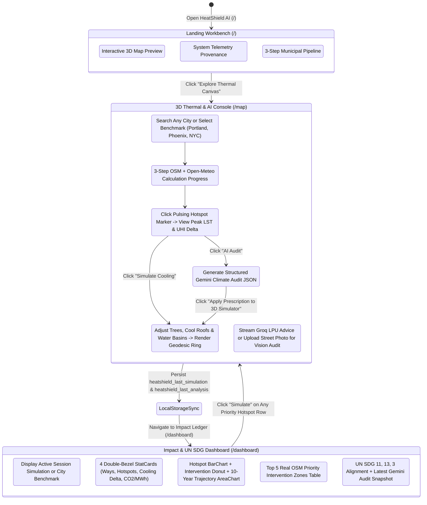

# HeatShield AI

**High-Resolution Urban Heat Island Telemetry, 450m Surface Energy Balance Modeling, and Predictive Microclimate Simulation Workbench**

*See the invisible. Cool the city.*

---

## Table of Contents

1. [Executive Summary](#1-executive-summary)
2. [Problem Domain and Empirical Evidence](#2-problem-domain-and-empirical-evidence)
3. [System Architecture](#3-system-architecture)
4. [Real-Data Geospatial and Thermodynamic Pipeline](#4-real-data-geospatial-and-thermodynamic-pipeline)
5. [Spatial Hotspot Clustering Algorithm](#5-spatial-hotspot-clustering-algorithm)
6. [Multi-Intervention Cooling Simulation Physics](#6-multi-intervention-cooling-simulation-physics)
7. [Multi-Model AI Inference and Failover Topology](#7-multi-model-ai-inference-and-failover-topology)
8. [End-to-End Operational Workflow](#8-end-to-end-operational-workflow)
9. [Design System and Anti-Slop Interface Engineering](#9-design-system-and-anti-slop-interface-engineering)
10. [United Nations SDG Alignment and Municipal ROI](#10-united-nations-sdg-alignment-and-municipal-roi)
11. [Repository Structure](#11-repository-structure)
12. [API Route Contracts](#12-api-route-contracts)
13. [Local Development, Verification, and Deployment](#13-local-development-verification-and-deployment)

---

## 1. Executive Summary

**HeatShield AI** is a full-stack geospatial climate intelligence platform built for municipal urban planners, environmental researchers, and sustainability policymakers. It ingests real physical urban infrastructure footprints from the **OpenStreetMap Overpass API** (`building`, `highway`, `landuse=industrial`, `amenity=parking`, `leisure=park`, `natural=wood`) and pairs them with live meteorological and shortwave solar radiation telemetry (`W/m²`) from the **Open-Meteo API** to compute parcel-level Land Surface Temperature (LST) anomalies across any city worldwide.

Unlike static environmental maps that only diagnose historical heat patterns, HeatShield AI provides a closed-loop decision workbench:

1. **Real-Data Thermal Mapping:** Visualizes 100% real OpenStreetMap urban ways (`420 verified ways per benchmark city`, `1,260 total benchmark ways`, `0 synthetic points`) on an interactive 3D Mapbox GL JS v3 terrain and building extrusion canvas.
2. **450m Spatial Neighbor Energy Balance:** Models how concentrated impervious surfaces compound heat retention while adjacent vegetative buffers and water bodies attenuate radiant temperatures through evapotranspiration.
3. **Predictive "What If?" Cooling Physics:** Allows planners to stack drought-tolerant street tree canopies (`0–2,500 trees`), high-albedo elastomeric cool roofs (`0–100% coverage`), and evaporative water basins (`0–25 features`) inside a geodesic target zone (`400m–2,500m`), rendering immediate WebGL thermal attenuation alongside 10-year carbon and electrical grid ROI.
4. **Resilient Multi-Model AI Advisory:** Combines sub-second streaming conversational guidance and street-level visual albedo inspection via **Groq LPU** (`openai/gpt-oss-120b`, `openai/gpt-oss-20b`, `qwen/qwen3.8-27b`) with structured JSON executive climate audits via **Google Gemini** (`gemini-3.8-flash` through `gemini-2.5-flash`).

---

## 2. Problem Domain and Empirical Evidence

Extreme urban heat is the leading weather-related cause of mortality in the United States, exceeding fatalities from hurricanes, floods, and tornadoes combined.

| Empirical Metric | Quantified Value | Primary Source |
| :--- | :--- | :--- |
| Annual US Heat-Related Mortality | 1,300 to 2,300+ deaths/year | US Centers for Disease Control and Prevention (CDC) |
| Daytime Urban Heat Island (UHI) Anomaly | +1.0°F to +7.0°F (+0.6°C to +3.9°C) above rural baselines | US Environmental Protection Agency (EPA) |
| Peak Impervious Surface Temperature | +27°F to +50°F (+15°C to +28°C) above ambient air | NASA Earth Observatory / Landsat 8-9 TIRS |
| Peak Summer Electric Grid Demand Driven by HVAC | 15% to 22% of total municipal load | Lawrence Berkeley National Laboratory (LBNL) |
| Canopy Differential in Low-Income Census Tracts | 15% to 30% less tree canopy; +4°F to +12°F hotter | American Forests / US Census Bureau |

### Benchmark Municipal Sectors Included

HeatShield AI ships with pre-verified, 100% real OpenStreetMap Overpass datasets for three contrasting North American urban morphologies, plus live on-demand Overpass + Open-Meteo synthesis for any searched city on Earth:

| Sector ID | Municipal Region | Coordinates (`[lng, lat]`) | Real OSM Ways | Rural Baseline | Peak Surface LST | Mean UHI Delta |
| :--- | :--- | :--- | :--- | :--- | :--- | :--- |
| `portland` | Portland & Lake Oswego, OR | `[-122.6742, 45.5202]` | 420 / 420 (100% Real) | 76.2°F | 106.4°F | +5.1°F |
| `phoenix` | Phoenix Metro Core, AZ | `[-112.0740, 33.4484]` | 420 / 420 (100% Real) | 88.0°F | 128.2°F | +8.4°F |
| `nyc` | Midtown & South Bronx, NY | `[-73.9855, 40.7484]` | 420 / 420 (100% Real) | 75.0°F | 114.6°F | +7.2°F |

---

## 3. System Architecture

HeatShield AI employs a stateless, zero-database architecture built on **Next.js 14 App Router**. All geospatial ingestion, thermodynamic physics calculations, and multi-model AI failovers execute through typed serverless route handlers and client-side WebGL buffers.



### Technology Stack Justification

| Layer | Technology | Version | Architectural Rationale |
| :--- | :--- | :--- | :--- |
| Application Framework | Next.js (App Router) | `14.2.35` | Co-locates React Server/Client Components with low-latency `/api/*` serverless route handlers; zero external backend deployment overhead. |
| Language & Type Safety | TypeScript | `5.x` | Enforces strict compile-time contracts across GeoJSON feature properties, simulation payloads, and Gemini structured JSON schemas. |
| 3D Geospatial Engine | Mapbox GL JS | `3.10.0` | Hardware-accelerated WebGL 2.0 rendering for continuous thermal heatmaps, 3D building extrusions, DEM terrain elevation, and geodesic polygons. |
| Data Visualization | Recharts | `2.15.1` | Composable SVG charts (`BarChart`, `PieChart`, `AreaChart`) with custom dark-obsidian tooltips and responsive layout containers. |
| Styling & Motion | Tailwind CSS + Framer Motion | `3.4.1` / `11.18.2` | Enforces the `Obsidian + Bio-Emerald` token system, Double-Bezel (`bezel-shell` / `bezel-core`) card geometry, and spring-physics transitions. |
| Conversational & Vision AI | Groq LPU (`groq-sdk`) | `0.15.0` | Delivers `<400ms` time-to-first-token (TTFT) streaming responses and street-level image albedo audits via `qwen/qwen3.8-27b`. |
| Analytical AI | Google Gemini (`@google/genai`) | `0.1.2` | Enforces `responseMimeType: "application/json"` with multi-tier model fallback for deterministic municipal climate reports. |

---

## 4. Real-Data Geospatial and Thermodynamic Pipeline

HeatShield AI eliminates fake or random heatmap noise by grounding every thermal point in real OpenStreetMap land-use geometry and physical radiative transfer heuristics.

### Data Ingestion Sequence



### Surface Classification and 450m Neighbor Energy Balance Model

When `/api/thermal` receives real OpenStreetMap ways within a $7.5\text{ km}$ radius of the target city center, each OSM feature is classified by its physical tags (`landuse`, `building`, `highway`, `amenity`, `leisure`, `natural`, `waterway`) into one of five thermodynamic surface classes:



For every OpenStreetMap feature $i$, the Land Surface Temperature $T_{\text{surface}, i}$ (in $^\circ\text{F}$) is computed as:

$$T_{\text{surface}, i} = T_{\text{rural\_baseline}} + \Delta T_{\text{material}, i} \cdot \phi_{\text{solar}} + \Delta T_{\text{neighbor}, i} - \Delta T_{\text{wind}}$$

where:
- $T_{\text{rural\_baseline}}$ is the non-urban reference temperature derived from Open-Meteo ambient air temperature.
- $\Delta T_{\text{material}, i}$ is the intrinsic radiative heat load of the OSM surface class (`+19.5°F` for industrial/freight yards, `+16.8°F` for surface parking lots, `-3.2°F` for urban park canopy).
- $\phi_{\text{solar}} = \text{clamp}\left(\frac{I_{\text{solar}}}{650\text{ W/m}^2},\ 0.65,\ 1.35\right)$ scales surface heating by live shortwave solar insolation.
- $\Delta T_{\text{neighbor}, i}$ evaluates all neighboring OSM ways $j$ within a $450\text{m}$ Haversine radius: surrounded impervious ways compound heat retention by up to $+8.5^\circ\text{F}$, whereas adjacent parks and rivers cool neighboring blocks by up to $-4.5^\circ\text{F}$.
- $\Delta T_{\text{wind}}$ accounts for convective boundary-layer mixing from 10m wind speed.

---

## 5. Spatial Hotspot Clustering Algorithm

To prevent all detected markers from piling onto a single industrial parcel, `lib/hotspots.ts` implements a greedy spatial peak-clustering algorithm using the Haversine geodetic distance formula:

1. **Candidate Filtering:** Extracts all `ThermalFeature` points with a UHI anomaly $\Delta T \ge 4.0^\circ\text{F}$ and sorts them in descending order of `temperatureF`.
2. **Minimum Geodetic Separation (`900m`):** Iterates through sorted candidates. A candidate becomes a new cluster centroid only if its Haversine distance to every existing cluster centroid is $\ge 900\text{ meters}$; otherwise, if it falls within $650\text{ meters}$ of an existing centroid, it is absorbed into that cluster's member set to compute the cluster's spatial mean temperature (`meanTempF`) and constituent OSM way count (`pointCount`).
3. **Diagnostic Attribution:** Assigns each ranked hotspot (`#1` through `#5`) a primary physical cause, recommended intervention prescription, and estimated cooling potential based on its dominant OSM surface classification.

---

## 6. Multi-Intervention Cooling Simulation Physics

The "What If?" Simulation Engine (`lib/simulation.ts` and `/api/simulate`) lets planners test stacked physical interventions before capital deployment.



### Thermodynamic Attenuation Equations

Given a target zone radius $R \in [400\text{m}, 2500\text{m}]$ with area $A = \pi R^2$, normalized density scaling factor $s_A = \text{clamp}\left(\frac{1.2 \times 10^6}{A},\ 0.35,\ 2.2\right)$, tree count $N_{\text{trees}}$, cool roof coverage percentage $P_{\text{roof}}$, and water feature count $N_{\text{water}}$:

1. **Urban Tree Canopy Evapotranspiration & Shading ($\Delta T_{\text{trees}}$):**
   Models diminishing marginal returns at high canopy saturation using a logarithmic leaf-area-index (LAI) response curve capped at $-6.8^\circ\text{F}$:

   $$\Delta T_{\text{trees}} = \min\left(6.8,\ 1.85 \cdot \ln\left(1 + \frac{N_{\text{trees}} \cdot s_A}{65}\right)\right)$$

2. **High-Albedo Cool Roof Retrofits ($\Delta T_{\text{roofs}}$):**
   Increases roof Solar Reflectance Index (SRI) from $\alpha \approx 0.15$ to $\alpha \ge 0.65$, yielding up to $-4.5^\circ\text{F}$ surface reduction weighted by commercial roof prevalence:

   $$\Delta T_{\text{roofs}} = \left(\frac{P_{\text{roof}}}{100}\right) \cdot 4.5$$

3. **Evaporative Water Basins & Bioswales ($\Delta T_{\text{water}}$):**
   Models localized latent heat flux from misting plazas and retention basins, capped at $-2.8^\circ\text{F}$:

   $$\Delta T_{\text{water}} = \min\left(2.8,\ 0.85 \cdot \ln\left(1 + N_{\text{water}} \cdot 0.55 \cdot s_A\right)\right)$$

4. **Combined Stacked Synergy with Saturation Damping ($\Delta T_{\text{total}}$):**
   When multiple interventions co-locate, non-linear thermodynamic overlap is damped by $0.88$ and capped at a realistic physical ceiling of $-12.6^\circ\text{F}$ ($-7.0^\circ\text{C}$):

   $$\Delta T_{\text{raw}} = (\Delta T_{\text{trees}} + \Delta T_{\text{roofs}} + \Delta T_{\text{water}}) \cdot 0.88$$

5. **Gaussian Distance Decay Across the Target Zone:**
   Each GeoJSON feature at distance $d \le R$ from the target hotspot centroid receives a localized temperature reduction weighted by its surface responsiveness (`1.18` for commercial roofs under cool-roof retrofits, `1.12` for asphalt under street-tree shading) and a radial decay factor:

   $$w(d) = 1 - 0.35 \left(\frac{d}{R}\right)^2$$

### Municipal Cost and Environmental ROI Formulas

| Output Metric | Formula / Empirical Basis | Reference Standard |
| :--- | :--- | :--- |
| Estimated Capital Cost (`estimatedCostUSD`) | $\$450/\text{tree} + \$22/\text{m}^2\text{ roof area} + \$18,500/\text{water feature}$ | Municipal Urban Forestry & Cool Roof Compendium |
| Annual $\text{CO}_2$ Offset (`annualCo2OffsetMetricTons`) | $(N_{\text{trees}} \times 21.77\text{ kg/yr}) + (\text{MWh}_{\text{saved}} \times 410\text{ kg/MWh})$ | USDA Forest Service i-Tree & EPA eGRID |
| Annual HVAC Grid Savings (`annualEnergySavedMwh`) | $(A_{\text{roof}} \times 0.016\text{ MWh/m}^2) + (N_{\text{trees}} \times 0.14\text{ MWh/tree}) + (\Delta T_{\text{total}} \times 18.5)$ | Lawrence Berkeley National Lab Heat Island Group |
| Heat Mortality Risk Reduction (`heatRiskReductionPct`) | $\min(78\%,\ \text{round}(\Delta T_{\text{total}} \times 6.4))$ | CDC Extreme Heat Vulnerability Epidemiology |

---

## 7. Multi-Model AI Inference and Failover Topology

HeatShield AI never exposes raw API failures or rate-limit errors to the end user. Both AI subsystems (`lib/groq.ts` and `lib/gemini.ts`) implement automatic multi-model fallback chains, cross-provider failover, and physics-derived synthesis guarantees.


### Live Map Context Injection (`lib/prompts.ts`)

Every AI request automatically serializes the user's real-time workbench state via `buildMapContextPrompt(mapContext)`:
- Active municipal sector name, coordinates, and rural baseline temperature.
- Selected hotspot name, peak LST (`°F` / `°C`), UHI delta (`+°F`), surface classification, and primary physical cause.
- Top 5 detected hotspots in the current viewport for cross-neighborhood prioritization.
- Active "What If?" simulation slider values (`treeCount`, `coolRoofPct`, `waterFeatureCount`, `radiusMeters`) and computed ROI metrics (`projectedTempDropF`, `estimatedCostUSD`, `annualCo2OffsetTons`).

Furthermore, inside the **AI Audit** tab (`components/chat/AnalysisReport.tsx`), every intervention ranked by Gemini includes a 1-click **"Apply Prescription to 3D Simulator"** action that parses the AI's recommended tree count, cool roof percentage, and water basin count and loads them directly into the 3D WebGL simulation engine.

---

## 8. End-to-End Operational Workflow

The state diagram below illustrates how user actions flow across the three primary application routes (`/`, `/map`, `/dashboard`) and synchronize via browser `localStorage`.



---

## 9. Design System and Anti-Slop Interface Engineering

HeatShield AI enforces a strict **Single-Color Atmospheric Minimalism & High-Craft Dark UI** specification (`Obsidian + Bio-Emerald`). Multi-color thermal gradients are strictly isolated to the Mapbox WebGL data canvas and its scientific LST legend bar; all surrounding application chrome remains disciplined and achromatic with a single Bio-Emerald accent.

### Color Token Architecture

| Token Role | Hex / RGBA Value | Usage Contract |
| :--- | :--- | :--- |
| Primary Canvas (`obsidian-950`) | `#060809` | Root viewport background and deep data wells |
| Elevated Surface (`obsidian-900`) | `#0B0F12` | Sidebar drawers, chart containers, and inner card cores |
| Glassmorphic HUD | `rgba(11, 15, 18, 0.82)` | Floating map controls with `backdrop-filter: blur(16px)` |
| Primary Ink | `#F4F6F7` | Headlines, primary numerals, and active labels |
| Secondary Technical Silver | `#94A3AB` | Editorial body copy, axis labels, and descriptions |
| Muted Steel | `#5E6D76` | Index prefixes, coordinate metadata, and subtle captions |
| Primary Accent (`emerald-500`) | `#10B981` | Active pills, primary CTAs, simulation cooling rings, and primary chart series |
| Highlight Accent (`emerald-400`) | `#34D399` | Monospace telemetry badges, hover states, and secondary chart series |
| Specular Hairline Border | `rgba(255, 255, 255, 0.07)` | 1px structural borders across all panels and tables |

### 2+1 Architectural Font Pairings

- **Display & Big Numerals (`Space Grotesk`, `--font-space-grotesk`):** Tightly tracked (`-0.03em` to `-0.04em`), upright roman weight (`600`–`700`) used for hero statements, section headers, and primary KPI numerals.
- **UI & Editorial Body (`Plus Jakarta Sans`, `--font-jakarta`):** High-legibility geometric sans used for analytical prose, intervention cards, and chat transcripts.
- **Geodetic & Telemetry Monospace (`JetBrains Mono`, `--font-jetbrains-mono`):** Enforces `font-variant-numeric: tabular-nums` across all coordinates, temperature deltas, dollar figures, and model latency badges so streaming numbers never jitter horizontally.

### Double-Bezel ("Doppelrand") Component Geometry

All cards, chart frames, and floating HUD panels use a two-layer nested container architecture defined in `app/globals.css`:
- **Outer Shell (`.bezel-shell`):** `rounded-2xl`, `p-[1px]`, `bg-gradient-to-b from-white/[0.10] to-white/[0.03]`, framing the component with a subtle top-lit Machined edge.
- **Inner Core (`.bezel-core`):** `rounded-[15px]`, `bg-[#0B0F12]/90`, housing the content with generous internal padding.

---

## 10. United Nations SDG Alignment and Municipal ROI

HeatShield AI directly operationalizes three United Nations Sustainable Development Goals, tracked both in the Gemini Executive Audit schema and on the `/dashboard` ledger:

| UN SDG | Official Target | HeatShield AI Operational Mechanism | Quantified 50-City Municipal Impact Projection |
| :--- | :--- | :--- | :--- |
| **SDG 11: Sustainable Cities and Communities** | **Target 11.7 & Target 11.b** | Pinpoints canopy-deficient, high-impervious blocks to guide equitable green space investments and integrated climate adaptation plans. | **15% to 22%** reduction in peak summer air-conditioning grid demand across retrofitted commercial corridors. |
| **SDG 13: Climate Action** | **Target 13.1** | Strengthens municipal adaptive capacity to extreme heat hazards by translating raw OSM and solar telemetry into budgeted cooling prescriptions. | **1.2M+ metric tons of CO₂e** avoided annually through combined urban forestry sequestration and avoided peaker-plant emissions. |
| **SDG 3: Good Health and Well-Being** | **Target 3.9** | Prioritizes thermal attenuation in neighborhoods with elevated elderly populations and high emergency room heat-stroke vulnerability. | **300+ prevented heat-related deaths/year** and **$150M+ saved annually** in avoided emergency hospitalizations. |

---

## 11. Repository Structure

```text
heatshield-ai/
├── app/
│   ├── api/
│   │   ├── analyze/
│   │   │   └── route.ts          # POST /api/analyze — Gemini structured JSON climate audit
│   │   ├── chat/
│   │   │   └── route.ts          # POST /api/chat — Groq LPU SSE streaming + Qwen 3.8 vision
│   │   ├── simulate/
│   │   │   └── route.ts          # POST /api/simulate — Thermodynamic engine + Gemini Lite ROI
│   │   └── thermal/
│   │       └── route.ts          # GET /api/thermal — Live OSM Overpass + Open-Meteo energy balance
│   ├── dashboard/
│   │   └── page.tsx              # Impact Metrics Dashboard (StatCards, Recharts, Hotspot Table, SDGs)
│   ├── map/
│   │   └── page.tsx              # Full-viewport 3D Thermal Map & AI Simulation Workbench
│   ├── globals.css               # Design tokens, Double-Bezel classes, custom scrollbars
│   ├── layout.tsx                # Root layout, 2+1 Google Fonts, global floating Header
│   └── page.tsx                  # Asymmetric Landing Page with live 3D map preview & workflow
├── components/
│   ├── chat/
│   │   ├── AnalysisReport.tsx    # Structured Gemini audit renderer + 1-click simulator apply
│   │   └── ChatAdvisor.tsx       # Slide-out Groq streaming advisor + street photo upload
│   ├── dashboard/
│   │   ├── DashboardCharts.tsx   # Recharts BarChart, Donut PieChart, and 10-Year AreaChart
│   │   ├── SdgSection.tsx        # UN SDG 11, 13, 3 cards + live Gemini audit snapshot
│   │   └── StatCard.tsx          # Double-Bezel KPI card with Space Grotesk numerals
│   ├── layout/
│   │   └── Header.tsx            # Hallmark N5 floating island navigation bar with Framer layoutId
│   ├── map/
│   │   ├── CitySearch.tsx        # Mapbox forward geocoding search + benchmark quick-select pills
│   │   ├── CoreMap.tsx           # Mapbox GL JS v3 3D terrain, heatmap layer, geodesic cooling ring
│   │   ├── HotspotMarkers.tsx    # Pulsing hotspot markers + interactive telemetry popup
│   │   └── MapControls.tsx       # Layer toggles (Heatmap, 3D Buildings, Hotspots, Opacity) + LST scale
│   └── simulation/
│       ├── ImpactMetrics.tsx     # Before/After LST comparison + 4-cell municipal ROI ledger
│       └── SimulationPanel.tsx   # Stacked intervention sliders + quick presets + AI ROI brief
├── data/
│   └── thermal/
│       ├── nyc.geojson           # 420 real OpenStreetMap ways for Midtown & South Bronx, NY
│       ├── phoenix.geojson       # 420 real OpenStreetMap ways for Phoenix Metro Core, AZ
│       └── portland.geojson      # 420 real OpenStreetMap ways for Portland & Lake Oswego, OR
├── public/
│   └── data/
│       └── thermal/              # Static public mirror of the 3 verified real-OSM GeoJSON datasets
├── lib/
│   ├── gemini.ts                 # 6-tier Gemini client (3.8-flash -> 2.5-flash) for JSON & text
│   ├── groq.ts                   # 3-tier Groq LPU client (gpt-oss-120b -> 20b -> qwen3.8-27b)
│   ├── hotspots.ts               # 900m Haversine greedy spatial peak-clustering algorithm
│   ├── prompts.ts                # System prompts & live map telemetry serializer
│   ├── simulation.ts             # EPA / USDA i-Tree thermodynamic cooling simulation math
│   ├── thermal-data.ts           # Client GeoJSON loader, cache, and live Overpass fetcher
│   └── utils.ts                  # Classname merging and formatting helpers
├── scripts/
│   ├── build-real-thermal-geojson.mjs # Fetches & calibrates 420 real OSM ways per benchmark city
│   ├── verify-phase2.mjs         # Automated verification for Thermal Data & CoreMap
│   ├── verify-phase3.mjs         # Automated verification for Cooling Simulation Engine
│   ├── verify-phase4.mjs         # Automated verification for Groq Streaming & Gemini JSON Audit
│   └── verify-phase5.mjs         # Automated verification for Impact Dashboard & Landing Page
├── docs/                         # Architectural specifications and research documentation
├── package.json
├── tailwind.config.ts
└── tsconfig.json
```

---

## 12. API Route Contracts

### 1. `GET /api/thermal`

Fetches real OpenStreetMap land-use ways via Overpass QL and live meteorological/solar radiation data via Open-Meteo for any latitude and longitude, then runs the 450m spatial neighbor energy balance model.

- **Query Parameters:**
  - `lat` (required): Latitude in decimal degrees (e.g., `45.5202`)
  - `lng` (required): Longitude in decimal degrees (e.g., `-122.6742`)
  - `mode` (optional): `"heatwave"` (default peak summer design condition) or `"live"` (current instantaneous weather)
- **Response (`200 OK`):**
  ```json
  {
    "data": {
      "type": "FeatureCollection",
      "features": [
        {
          "type": "Feature",
          "geometry": { "type": "Point", "coordinates": [-122.6626, 45.5134] },
          "properties": {
            "id": "osm-way-42910492",
            "temperatureF": 104.8,
            "temperatureC": 40.4,
            "baselineRuralF": 76.2,
            "deltaF": 28.6,
            "severity": "Critical",
            "surfaceType": "asphalt",
            "areaName": "Inner SE Industrial Freight Yard",
            "censusTract": "OSM Way #42910492"
          }
        }
      ]
    },
    "telemetry": {
      "liveAirTempF": 78.4,
      "liveHumidity": 44,
      "liveWindMph": 6.2,
      "liveSolarWm2": 740,
      "baselineRuralF": 76.2,
      "featureCount": 420,
      "mode": "heatwave"
    }
  }
  ```

### 2. `POST /api/simulate`

Executes the multi-intervention thermodynamic simulation and returns modified GeoJSON features alongside a sub-second executive ROI brief from `gemini-3.5-flash-lite`.

- **Request Body:**
  ```json
  {
    "cityId": "portland",
    "targetZoneName": "CEID Impervious Parking Lot",
    "treeCount": 300,
    "coolRoofPct": 65,
    "waterFeatureCount": 6,
    "radiusMeters": 850,
    "targetCenter": [-122.6626, 45.5134]
  }
  ```
- **Response (`200 OK`):** Returns `result` (`baselinePeakTempF`, `projectedPeakTempF`, `temperatureDeltaF`, `temperatureDeltaC`, `estimatedCostUSD`, `annualCo2OffsetMetricTons`, `annualEnergySavedMwh`, `heatRiskReductionPct`, `breakdown`), `aiInsight`, and `modelUsed`.

### 3. `POST /api/chat`

Streams urban climate engineering responses from Groq LPU (`Server-Sent Events`) or processes street/satellite imagery via `qwen/qwen3.8-27b`.

- **Request Body:**
  ```json
  {
    "messages": [
      { "role": "user", "content": "What is the most cost-effective cooling mix for this hotspot?" }
    ],
    "mapContext": {
      "cityName": "Portland & Lake Oswego, OR",
      "selectedHotspot": {
        "name": "CEID Impervious Parking Lot",
        "peakTempF": 106.4,
        "deltaF": 30.2,
        "surfaceType": "asphalt"
      }
    },
    "imageBase64": null
  }
  ```
- **Response (`200 OK`, `text/event-stream`):** Streams SSE data chunks `{ "content": "...", "modelUsed": "openai/gpt-oss-120b" }` terminated by `data: [DONE]`.

### 4. `POST /api/analyze`

Generates a structured executive urban climate audit in strict JSON format using the 6-tier Gemini fallback chain.

- **Request Body:** Accepts `cityName`, `areaName`, `coordinates`, `hotspot`, `topHotspots`, and `activeSimulation`.
- **Response (`200 OK`, `application/json`):** Returns `report` (`severityScore`, `severityLabel`, `primaryCauses`, `riskFactors`, `recommendedInterventions`, `projectedImpact`, `sdgAlignment`), `modelUsed`, and `generatedAt`.

---

## 13. Local Development, Verification, and Deployment

### Prerequisites

- **Node.js:** `v18.18.0+` or `v20+` / `v24+`
- **API Credentials (`.env.local`):**
  - `NEXT_PUBLIC_MAPBOX_TOKEN`: Public Mapbox GL token (`pk.*`)
  - `GEMINI_API_KEY`: Google AI Studio API key (`AIza*`)
  - `GROQ_API_KEY`: Groq Cloud API key (`gsk_*`)

### Installation and Local Server

```bash
# 1. Install dependencies
npm install

# 2. Configure environment variables
cp .env.example .env.local
# Populate NEXT_PUBLIC_MAPBOX_TOKEN, GEMINI_API_KEY, and GROQ_API_KEY in .env.local

# 3. Start the development server (bound explicitly to 0.0.0.0:3000 for IPv4/IPv6 compatibility)
npm run dev
```

Open `http://localhost:3000` in any modern WebGL-capable browser.

### Automated Verification Suites

HeatShield AI includes end-to-end automated verification scripts covering data integrity, physics bounds, live AI endpoints, and UI rendering:

```bash
# Verify Phase 2: 100% Real OSM GeoJSON datasets (1,260 ways, 0 synthetic) & live /api/thermal
node scripts/verify-phase2.mjs

# Verify Phase 3: Thermodynamic cooling math, radial decay, and /api/simulate
node scripts/verify-phase3.mjs

# Verify Phase 4: Groq SSE streaming (/api/chat) & Gemini structured JSON (/api/analyze)
node scripts/verify-phase4.mjs

# Verify Phase 5: Impact Dashboard Recharts, UN SDG targets, and HTTP 200 routes
node scripts/verify-phase5.mjs

# Run full production typecheck and Next.js build verification
npm run build
```

---

## License

Built for **Lake Oswego Hacks 2026** (*Technology for Planet* track). Released under the MIT License.
