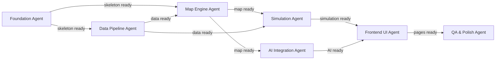

# HeatShield AI — Agent Architecture

> **Last Updated:** 2026-09-24
> **Source of Truth:** Models verified live from Groq and Gemini API endpoints.

This document defines the multi-agent system for both **building** and **running** HeatShield AI. Every model listed below was verified as **active and available** via live API queries.

---

## 0. Verified Available Models

### Groq API — Available Text Models (verified live)

| Model ID | Context Window | Max Output | Features | Best For |
|:---|:---|:---|:---|:---|
| `openai/gpt-oss-120b` | 131,072 | 65,536 | tools, json_mode, structured_outputs, reasoning | Complex reasoning, detailed chat responses |
| `openai/gpt-oss-20b` | 131,072 | 65,536 | tools, json_mode, structured_outputs, reasoning | Fast fallback, lower rate limit risk |
| `qwen/qwen3.8-27b` | 131,072 | 16,384 | tools, json_mode, reasoning, **🖼️ IMAGE INPUT** | **Vision-capable!** Can analyze images/screenshots |

> [!IMPORTANT]
> **`qwen/qwen3.8-27b` supports image input!** This is a unique capability — no other Groq text model has vision. We use this for any task needing image analysis (e.g., analyzing map screenshots, visual QA).

### Gemini API — Available Flash Models (verified live)

| Model ID | Context Window | Max Output | Best For |
|:---|:---|:---|:---|
| `gemini-3.8-flash` | 1,048,576 | 65,536 | Primary — latest, most capable |
| `gemini-3.7-flash` | 1,048,576 | 65,536 | Fallback 1 |
| `gemini-3.6-flash` | 1,048,576 | 65,536 | Fallback 2 |
| `gemini-3.5-flash` | 1,048,576 | 65,536 | Fallback 3 |
| `gemini-3.5-flash-lite` | 1,048,576 | 65,536 | Sandbox — rate-limit-safe, lightweight tasks |
| `gemini-2.5-flash` | 1,048,576 | 65,536 | Legacy fallback (stable, well-tested) |

---

## 1. Build-Time Agents (Antigravity)

These agents are invoked via Antigravity to **construct** HeatShield AI during the hackathon.

| Agent Name | Role | Model | Responsibilities | Reads | Writes |
|:---|:---|:---|:---|:---|:---|
| **Orchestrator** | Workflow Manager | Claude Opus 4.6 | Phase sequencing, dependency checks, quality gates, spawns other agents | All `/docs/` | Phase state tracking |
| **Foundation Agent** | Project Setup | Claude Opus 4.6 | Next.js scaffold, deps, tailwind config, env template, folder structure | `ARCHITECTURE.md` | Project skeleton, `package.json`, configs |
| **Data Pipeline Agent** | Data Processing | Gemini 3.8 Flash | Generate realistic thermal datasets, GeoJSON for demo cities, data loading utils | `API-RESEARCH.md` | `/data/`, `/lib/thermal-data.ts` |
| **Map Engine Agent** | Map & Viz | Claude Opus 4.6 | Mapbox GL integration, heatmap layer, hotspot markers, geocoding, controls | `UI-SPEC.md`, `ARCHITECTURE.md` | `/components/map/`, map page |
| **Simulation Agent** | Simulation Logic | Claude Opus 4.6 | Cooling algorithms, intervention panel UI, before/after viz, impact calc | `FEATURES.md`, `UI-SPEC.md` | `/lib/simulation.ts`, `/components/simulation/` |
| **AI Integration Agent** | API Clients | Claude Opus 4.6 | Groq + Gemini clients with fallback chains, chat UI, analysis endpoint | `API-RESEARCH.md`, `UI-SPEC.md` | `/lib/groq.ts`, `/lib/gemini.ts`, `/app/api/`, `/components/chat/` |
| **Frontend UI Agent** | Pages & Polish | Claude Opus 4.6 | Landing page, dashboard, charts, navigation, responsive, animations | `UI-SPEC.md`, `FEATURES.md` | `/app/page.tsx`, `/app/dashboard/`, `/components/ui/` |
| **QA & Polish Agent** | Review & Fix | Claude Opus 4.6 | Lint, build check, error states, loading states, edge cases, final polish | All source code, `FEATURES.md` | Bug fixes across codebase |

---

## 2. Runtime Agents (Inside the Running App)

These are the AI agents users interact with inside HeatShield AI.

### 2.1. Chat Advisor Agent — Groq

The primary conversational AI. Users ask questions about heat islands, cooling strategies, costs, and environmental impact. Must respond fast for good UX.

- **Why Groq:** Ultra-low latency inference. Users expect instant chat responses. Groq's LPU delivers <500ms first-token latency.
- **Primary Model:** `openai/gpt-oss-120b` — Most capable, supports reasoning + structured outputs
- **Fallback 1:** `openai/gpt-oss-20b` — Same features, lighter, lower rate limit risk
- **Fallback 2:** `qwen/qwen3.8-27b` — Different provider on same API, good reasoning
- **Endpoint:** `https://api.groq.com/openai/v1/chat/completions`
- **Configuration:**

| Parameter | Value | Rationale |
|:---|:---|:---|
| Temperature | `0.7` | Conversational but grounded |
| Max Tokens | `1024` | Detailed enough without being verbose |
| Streaming | `true` | Essential for perceived speed — words appear as they generate |
| Top P | `0.9` | Slight diversity in responses |

- **System Prompt:**
```text
You are HeatShield AI Advisor — an expert urban climatologist and sustainability consultant.

ROLE: Help users understand urban heat islands (UHI), evaluate cooling interventions, and make data-driven decisions about urban cooling strategies.

GUIDELINES:
- Be concise and actionable. Lead with the key insight, then provide supporting data.
- Always quantify when possible: temperatures in °F and °C, costs in USD, areas in sq meters/acres.
- Reference real research and EPA/NOAA data when discussing UHI effects.
- When recommending interventions, rank by cost-effectiveness (cooling per dollar).
- Cooling strategies you should know deeply: tree canopy expansion, cool/green roofs, reflective pavements, urban parks, water features, shade structures, building orientation.
- If the user provides coordinates or area context, tailor your response to that specific location.
- Never fabricate specific study citations. Use general "EPA research shows..." or "studies indicate..." framing.

TONE: Professional but accessible. A knowledgeable advisor, not an academic lecturer.
```

### 2.2. Analysis Report Agent — Gemini

Generates detailed structured analysis reports for selected geographic areas. Called when user clicks "Generate AI Report."

- **Why Gemini:** 1M token context window allows ingesting large datasets. Superior at structured JSON output. Better at analytical reasoning over data.
- **Primary Model:** `gemini-3.8-flash`
- **Fallback Chain:** `gemini-3.7-flash` → `gemini-3.6-flash` → `gemini-3.5-flash`
- **Endpoint:** `https://generativelanguage.googleapis.com/v1beta/models/{model}:generateContent`
- **Configuration:**

| Parameter | Value | Rationale |
|:---|:---|:---|
| Temperature | `0.3` | Deterministic — analysis must be consistent and reliable |
| Max Tokens | `2048` | Detailed report without over-generation |
| Response MIME | `application/json` | Structured output for UI rendering |

- **System Prompt:**
```text
You are an expert urban heat island analyst. Given thermal data and geographic context for a specific area, generate a comprehensive analysis report.

OUTPUT FORMAT — strict JSON:
{
  "areaName": "string — name of the analyzed area",
  "severityScore": "number 1-10 — overall heat island severity",
  "severityLabel": "string — Low/Moderate/High/Critical",
  "averageTemperature": "number — average surface temp in °F",
  "peakTemperature": "number — highest recorded surface temp in °F",
  "primaryCauses": ["array of strings — top 3-5 causes of heat accumulation"],
  "riskFactors": ["array of strings — vulnerable populations, infrastructure risks"],
  "recommendedInterventions": [
    {
      "type": "string — e.g., 'Tree Canopy Expansion'",
      "priority": "string — High/Medium/Low",
      "estimatedCost": "string — e.g., '$50,000-$120,000'",
      "coolingPotential": "string — e.g., '2-4°F reduction'",
      "implementationTime": "string — e.g., '6-18 months'",
      "description": "string — 1-2 sentence explanation"
    }
  ],
  "projectedImpact": "string — paragraph describing cumulative cooling if all interventions applied",
  "sdgAlignment": ["array of strings — relevant UN SDG numbers and names"]
}

RULES:
- Base all estimates on peer-reviewed UHI research and EPA guidelines.
- Be realistic about costs and timelines.
- Always recommend at least 3 interventions ranked by cost-effectiveness.
- Severity score: 1-3 = Low, 4-5 = Moderate, 6-7 = High, 8-10 = Critical.
```

### 2.3. Simulation Advisor — Gemini Lite

Fast, lightweight model for frequent small calls during simulation interactions.

- **Why Gemini Lite:** Cheapest, fastest, most rate-limit-resistant. Called on every slider change or tooltip hover — needs to be instant and within free tier limits.
- **Model:** `gemini-3.5-flash-lite` (no fallback needed — extremely stable)
- **Configuration:**

| Parameter | Value | Rationale |
|:---|:---|:---|
| Temperature | `0.2` | Highly deterministic for calculations |
| Max Tokens | `256` | Short, focused responses |

- **Use Cases:**
  - Quick cost estimate when user adjusts tree count slider
  - Tooltip explanations ("What is albedo?")
  - Parameter validation ("Is 500 trees realistic for this area?")
  - Summary text for simulation results

### 2.4. Vision Analysis Agent — Groq (Qwen)

**Bonus capability** — can analyze images, including map screenshots sent by users.

- **Why Qwen on Groq:** Only Groq model with image input. Fast inference for visual analysis.
- **Model:** `qwen/qwen3.8-27b`
- **Use Cases:**
  - User uploads a photo of their neighborhood → AI identifies heat-trapping surfaces
  - Screenshot analysis for reports
  - Visual verification of map renders (internal QA)
- **Configuration:**

| Parameter | Value | Rationale |
|:---|:---|:---|
| Temperature | `0.5` | Balanced for visual analysis |
| Max Tokens | `1024` | Detailed visual descriptions |

---

## 3. Model Fallback Chain Implementation

### Groq Fallback (`/lib/groq.ts`)

```typescript
import Groq from 'groq-sdk';

const groq = new Groq({ apiKey: process.env.GROQ_API_KEY });

// Ordered by capability: best first, lightest last
const GROQ_CHAT_MODELS = [
  'openai/gpt-oss-120b',   // Best reasoning, structured outputs
  'openai/gpt-oss-20b',    // Same features, lower rate limit risk
  'qwen/qwen3.8-27b',      // Different provider fallback, 16K max output
] as const;

interface GroqCallOptions {
  temperature?: number;
  max_tokens?: number;
  stream?: boolean;
  response_format?: { type: string };
}

export async function callGroqWithFallback(
  messages: Array<{ role: string; content: string }>,
  options: GroqCallOptions = {}
) {
  const errors: string[] = [];

  for (const model of GROQ_CHAT_MODELS) {
    try {
      const response = await groq.chat.completions.create({
        model,
        messages,
        temperature: options.temperature ?? 0.7,
        max_tokens: options.max_tokens ?? 1024,
        stream: options.stream ?? false,
        ...(options.response_format && { response_format: options.response_format }),
      });

      console.log(`[Groq] Success with model: ${model}`);
      return response;
    } catch (error: any) {
      const status = error?.status || error?.statusCode;
      const msg = error?.message || 'Unknown error';
      errors.push(`${model}: ${status} - ${msg}`);

      // Retry on rate limit (429) or service unavailable (503)
      if (status === 429 || status === 503) {
        console.warn(`[Groq] ${model} failed (${status}), trying next...`);
        continue;
      }

      // Don't retry on auth errors (401/403) or bad requests (400)
      throw error;
    }
  }

  throw new Error(
    `All Groq models exhausted. Errors:\n${errors.join('\n')}`
  );
}

// Streaming variant for chat UI
export async function streamGroqChat(
  messages: Array<{ role: string; content: string }>,
  options: Omit<GroqCallOptions, 'stream'> = {}
) {
  return callGroqWithFallback(messages, { ...options, stream: true });
}
```

### Gemini Fallback (`/lib/gemini.ts`)

```typescript
import { GoogleGenerativeAI } from '@google/generative-ai';

const genAI = new GoogleGenerativeAI(process.env.GEMINI_API_KEY!);

// Primary fallback chain: newest → oldest
const GEMINI_ANALYSIS_MODELS = [
  'gemini-3.8-flash',
  'gemini-3.7-flash',
  'gemini-3.6-flash',
  'gemini-3.5-flash',
] as const;

// Lite model for high-frequency, low-stakes calls
const GEMINI_LITE_MODEL = 'gemini-3.5-flash-lite';

// Legacy stable fallback if all 3.x models fail
const GEMINI_LEGACY_FALLBACK = 'gemini-2.5-flash';

interface GeminiCallOptions {
  temperature?: number;
  maxOutputTokens?: number;
  responseMimeType?: string;
}

export async function callGeminiWithFallback(
  prompt: string,
  systemInstruction: string,
  options: GeminiCallOptions = {}
) {
  const allModels = [...GEMINI_ANALYSIS_MODELS, GEMINI_LEGACY_FALLBACK];
  const errors: string[] = [];

  for (const modelName of allModels) {
    try {
      const model = genAI.getGenerativeModel({
        model: modelName,
        systemInstruction,
        generationConfig: {
          temperature: options.temperature ?? 0.3,
          maxOutputTokens: options.maxOutputTokens ?? 2048,
          ...(options.responseMimeType && {
            responseMimeType: options.responseMimeType,
          }),
        },
      });

      const result = await model.generateContent(prompt);
      console.log(`[Gemini] Success with model: ${modelName}`);
      return result.response;
    } catch (error: any) {
      const status = error?.status || error?.statusCode;
      const msg = error?.message || 'Unknown error';
      errors.push(`${modelName}: ${status} - ${msg}`);

      if (status === 429 || status === 503 || msg?.includes('quota')) {
        console.warn(`[Gemini] ${modelName} failed (${status}), trying next...`);
        continue;
      }

      throw error;
    }
  }

  throw new Error(
    `All Gemini models exhausted. Errors:\n${errors.join('\n')}`
  );
}

// Lightweight call for tooltips, quick calcs — no fallback needed
export async function callGeminiLite(
  prompt: string,
  systemInstruction: string = 'You are a helpful sustainability assistant. Be very concise.'
) {
  const model = genAI.getGenerativeModel({
    model: GEMINI_LITE_MODEL,
    systemInstruction,
    generationConfig: {
      temperature: 0.2,
      maxOutputTokens: 256,
    },
  });

  const result = await model.generateContent(prompt);
  return result.response;
}

// JSON-specific call for structured analysis reports
export async function callGeminiJSON(
  prompt: string,
  systemInstruction: string
) {
  return callGeminiWithFallback(prompt, systemInstruction, {
    temperature: 0.3,
    maxOutputTokens: 2048,
    responseMimeType: 'application/json',
  });
}
```

---

## 4. Agent Handoff Protocol

### 4.1 Input/Output Contracts

Each agent reads specific docs and writes to specific directories. **No agent modifies files outside its designated output paths** unless explicitly directed by the Orchestrator.



### 4.2 Quality Gates Between Phases

Before advancing to the next phase, the Orchestrator runs:

```bash
# Gate 1: Code compiles
npx next build 2>&1 | tail -5

# Gate 2: No lint errors
npx next lint 2>&1 | tail -10

# Gate 3: Dev server starts
npm run dev & sleep 5 && curl -s http://localhost:3000 | head -1
```

If any gate fails, the Orchestrator sends the error output to the responsible agent for fixing before proceeding.

### 4.3 Error Recovery

1. **First failure:** Orchestrator retries the agent with the error message appended to the prompt
2. **Second failure:** Orchestrator spawns a fresh agent instance with simplified scope
3. **Third failure:** Orchestrator flags the issue for human intervention (you)

---

## 5. API Key Allocation

| Context | API | Env Variable | Models Used | Purpose |
|:---|:---|:---|:---|:---|
| **Build-time** | Antigravity Platform | (managed by platform) | Claude Opus 4.6, Gemini 3.8 Flash | AI agents writing the code |
| **Runtime — Chat** | Groq | `GROQ_API_KEY` | `openai/gpt-oss-120b` → `openai/gpt-oss-20b` → `qwen/qwen3.8-27b` | User-facing chat advisor |
| **Runtime — Analysis** | Gemini | `GEMINI_API_KEY` | `gemini-3.8-flash` → `3.7` → `3.6` → `3.5` → `2.5-flash` | Area analysis reports |
| **Runtime — Sandbox** | Gemini | `GEMINI_API_KEY` | `gemini-3.5-flash-lite` | Quick calcs, tooltips, slider updates |
| **Runtime — Vision** | Groq | `GROQ_API_KEY` | `qwen/qwen3.8-27b` | Image analysis (if implemented) |

> [!NOTE]
> All runtime API calls use the **same 2 API keys** (`GROQ_API_KEY` and `GEMINI_API_KEY`). The fallback chains ensure we stay within free tier rate limits by cascading to lighter models when limits are hit.
