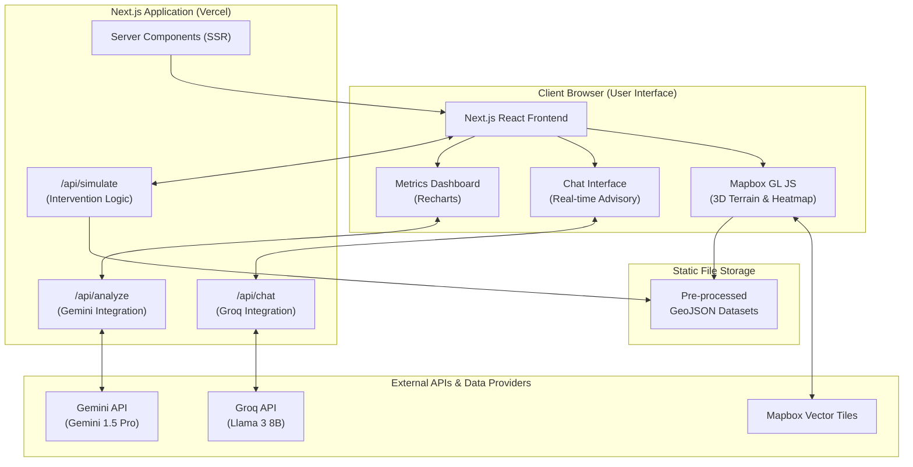
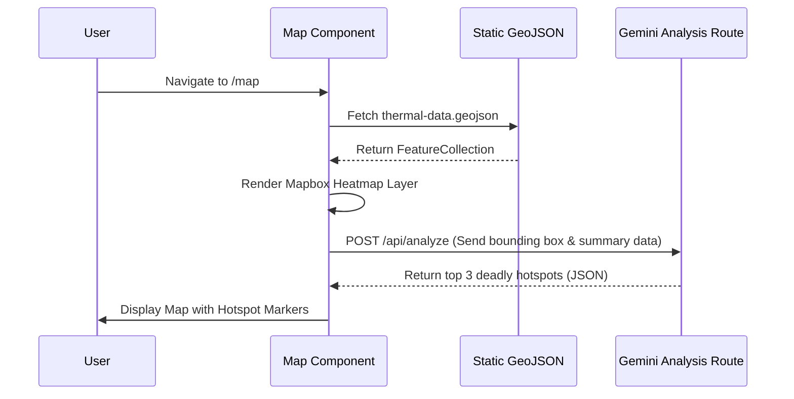
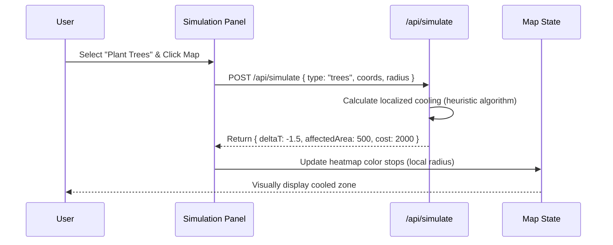
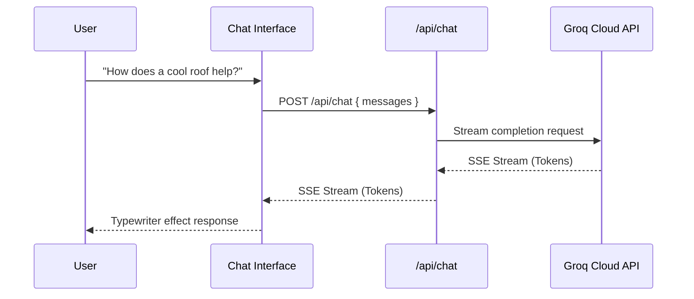
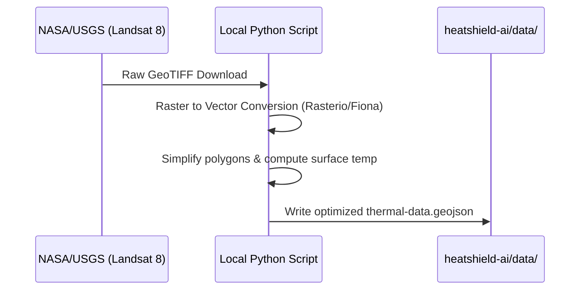

# HeatShield AI - Architecture & Implementation Guide

## 1. High-Level System Diagram

The following flowchart illustrates the high-level architecture of HeatShield AI, showing the end-to-end data flow from the client browser through the Next.js backend and out to our external APIs and static data stores.



---

## 2. Tech Stack with Justification

This stack is heavily optimized for a 32-hour hackathon environment, focusing on developer velocity, performance, and immediate AI integration without the overhead of database schema migrations or complex DevOps.

| Technology | Selection | Justification & Hackathon Advantage |
| :--- | :--- | :--- |
| **Framework** | Next.js 14+ (App Router) | **Why:** Provides instant API routes alongside frontend code, excellent SSR for initial load speed, and seamless zero-config deployment on Vercel. Essential for rapid full-stack iteration. |
| **Styling** | Tailwind CSS + shadcn/ui | **Why:** Eliminates context switching between CSS and TSX. shadcn/ui provides highly accessible, copy-paste components that are extremely AI-agent-friendly to generate and modify. |
| **Map Engine** | Mapbox GL JS | **Why:** Superior WebGL performance for rendering tens of thousands of thermal data points. Built-in support for 3D terrain and extruded buildings, which is crucial for urban heat visualization. Free tier easily covers hackathon traffic. |
| **Charts** | Recharts | **Why:** Native React chart components with declarative syntax. Easily binds to the output state from our simulation API routes. |
| **AI (Analysis)** | Gemini 1.5 Pro API | **Why:** Massive context window (1M+ tokens) allows us to feed raw GeoJSON structures directly into the prompt to identify correlations and generate structured urban planning summaries. |
| **AI (Chat)** | Groq API | **Why:** Ultra-fast inference (800+ tokens/second). Provides a remarkably snappy, real-time conversational UX that wows hackathon judges. |
| **Deployment** | Vercel | **Why:** Push-to-deploy from GitHub. Automatically handles serverless functions for our Next.js API routes. |
| **Database** | *None (Static Data)* | **Why:** Database setup (Postgres/MongoDB) introduces latency in development. Loading pre-processed GeoJSON locally and keeping application state in memory/URL parameters guarantees we finish the project within the 32-hour limit. |

---

## 3. Detailed Data Flow Diagrams

### 3.1. Map Initialization Flow
Loading the city environment, rendering the thermal layer, and automatically identifying the highest risk hotspots.



### 3.2. Simulation Flow
User places a cooling intervention (e.g., planting trees, adding a cool roof) and the system projects the temperature reduction.



### 3.3. Chat Flow (Advisor)
Real-time conversation with the AI urban planner using Groq.



### 3.4. Data Pipeline (Offline / Pre-Hackathon)
How raw data becomes application data. *Note: This step happens offline, the app only consumes the final GeoJSON.*



---

## 4. Folder Structure

The project MUST strictly adhere to this structure. AI coding agents should map their file creation operations precisely to these paths.

```text
heatshield-ai/
├── app/                    # Next.js App Router
│   ├── layout.tsx
│   ├── page.tsx            # Landing page
│   ├── map/
│   │   └── page.tsx        # Main map view
│   ├── dashboard/
│   │   └── page.tsx        # Impact dashboard
│   └── api/
│       ├── chat/
│       │   └── route.ts    # Groq chat endpoint
│       ├── analyze/
│       │   └── route.ts    # Gemini analysis endpoint
│       └── simulate/
│           └── route.ts    # Simulation endpoint
├── components/
│   ├── ui/                 # shadcn/ui components
│   ├── map/                # Map-related components
│   ├── simulation/         # Simulation panel components
│   ├── chat/               # Chat components
│   └── dashboard/          # Dashboard components
├── lib/
│   ├── gemini.ts           # Gemini API client with fallback chain
│   ├── groq.ts             # Groq API client with fallback chain
│   ├── thermal-data.ts     # Thermal data processing
│   ├── simulation.ts       # Cooling simulation logic
│   └── utils.ts            # Shared utilities (Tailwind merge, etc.)
├── data/
│   ├── thermal/            # Pre-processed thermal datasets (.geojson)
│   └── cities/             # City boundary/metadata (.json)
├── public/
│   └── images/
├── .env.local              # API keys
├── package.json
├── tailwind.config.ts
├── tsconfig.json
└── next.config.ts
```

---

## 5. Environment Variables

The application requires the following environment variables. They should be stored in `.env.local` during development and configured in Vercel for production.

```bash
# Mapbox Configuration
NEXT_PUBLIC_MAPBOX_TOKEN="pk.eyJ1IjoibW9ja3VzZXIiLCJhIjoiY2xw...real_token_here"

# AI Provider Keys
GEMINI_API_KEY="AIzaSyA...real_token_here"
GROQ_API_KEY="gsk_...real_token_here"

# Application Metadata
NEXT_PUBLIC_APP_URL="http://localhost:3000"
```

---

## 6. Key Design Decisions

1.  **Why NO Database:** Setting up PostgreSQL, Prisma/Drizzle, and running migrations takes hours. By relying on static JSON/GeoJSON for read-only data, and storing user interactions (simulations) in React State/Context, we eliminate DB setup overhead entirely.
2.  **App Router vs Pages Router:** App Router (`app/`) is chosen because Next.js Server Components allow us to read from the local file system (`fs.readFileSync`) securely and pass parsed JSON to the client without exposing the raw file size in the client bundle payload initially.
3.  **Mapbox over Leaflet/Google Maps:** Leaflet lacks native 3D building extrusion which is critical for urban visualization. Google Maps has rigid styling. Mapbox GL JS provides seamless data-driven styling for our heatmaps.
4.  **Separating Gemini and Groq:** Gemini 1.5 Pro is used for the `/api/analyze` route because its massive context window can ingest large chunks of regional thermal data to output highly accurate, structured analytics. Groq is used for `/api/chat` because user chat requires instant (< 500ms) time-to-first-token to feel like a responsive assistant.
5.  **Client-Side Rendering (CSR) for Maps:** The map canvas cannot be server-side rendered. All Mapbox components and simulation logic MUST be wrapped in components with the `"use client";` directive at the top of the file.

---

## 7. API Route Contracts

To ensure AI agents can build modularly, these are the strict TypeScript interfaces for our Next.js API Routes.

### 7.1. Chat Route
**Endpoint:** `POST /api/chat`
**AI Model:** Groq (Llama 3)
**Purpose:** Real-time conversational AI.

```typescript
// Request Body
interface ChatRequest {
  messages: {
    role: "user" | "assistant" | "system";
    content: string;
  }[];
}

// Response: standard Vercel AI SDK text stream (text/event-stream)
```

### 7.2. Analyze Route
**Endpoint:** `POST /api/analyze`
**AI Model:** Gemini 1.5 Pro
**Purpose:** Analyze current map view data to report insights.

```typescript
// Request Body
interface AnalyzeRequest {
  boundingBox: {
    minLng: number;
    minLat: number;
    maxLng: number;
    maxLat: number;
  };
  averageTemp: number;
  populationDensityEstimate: number;
}

// Response Body (JSON)
interface AnalyzeResponse {
  severityLevel: "Low" | "Moderate" | "High" | "Critical";
  primaryRiskFactors: string[];
  recommendedIntervention: string;
  executiveSummary: string;
}
```

### 7.3. Simulate Route
**Endpoint:** `POST /api/simulate`
**AI Model:** None (Deterministic local math + helper functions)
**Purpose:** Calculate the effect of placing an intervention on the map.

```typescript
// Request Body
interface SimulateRequest {
  interventionType: "tree_canopy" | "cool_roof" | "water_feature";
  coordinates: {
    lng: number;
    lat: number;
  };
  radiusMeters: number;
  currentLocalTemp: number;
}

// Response Body (JSON)
interface SimulateResponse {
  projectedTemp: number;         // New temperature after intervention
  temperatureDelta: number;      // e.g., -2.5 (degrees Celsius)
  affectedAreaSqMeters: number;  
  estimatedCostUSD: number;
}
```
