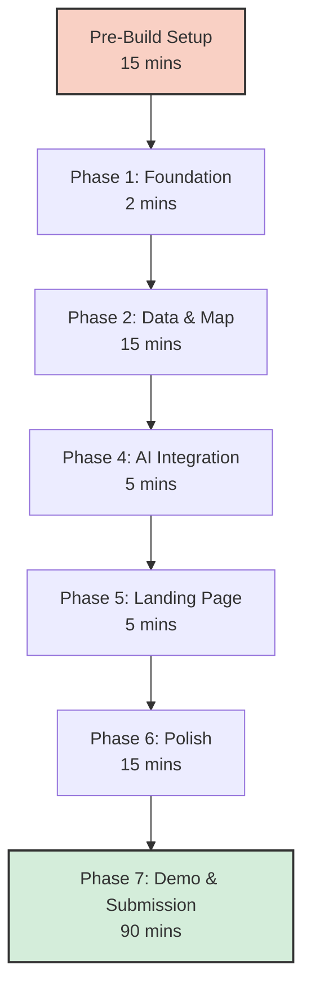

# Human Developer Guide: Manual Action Required 🛑

This document outlines **EVERY manual step** the human developer needs to perform for the **HeatShield AI** project. While AI agents (Antigravity) will write the code, certain actions (account creation, QA, deployment, submission) REQUIRE human intervention.

## 📌 Hackathon Context
- **Project:** HeatShield AI — Urban Heat Island Mapper & Cool City Planner
- **Tech Stack:** Next.js 14+, Tailwind CSS, Mapbox GL JS, Gemini API, Groq API, Vercel
- **Constraint:** 32-hour hackathon

---

## 🗺 Workflow Overview



---

## 🛠 Pre-Build Setup (Before Phase 1)

These steps must be completed before the AI agents begin writing application logic.

### 1. Create Mapbox Account & Get Access Token
- **What to do:**
  1. Go to: [Mapbox Signup](https://account.mapbox.com/auth/signup/) and create a free account.
  2. Navigate to: [Access Tokens](https://account.mapbox.com/access-tokens/).
  3. Copy the `Default public token`.
- **Why it's needed:** Mapbox GL JS requires authentication to load map tiles.
- **Verification:** Token string must start with `pk.`.
- **Time Estimate:** 3 minutes

### 2. Get Gemini API Key
- **What to do:**
  1. Go to: [Google AI Studio](https://aistudio.google.com/apikey).
  2. Sign in with a Google account.
  3. Click **Create API Key** and select/create a Google Cloud project.
  4. Copy the generated key.
- **Why it's needed:** Primary LLM for chat and logic.
- **Verification:** Token string must start with `AIza`.
- **Time Estimate:** 3 minutes

### 3. Get Groq API Key
- **What to do:**
  1. Go to: [Groq Console](https://console.groq.com/keys).
  2. Create an account or sign in.
  3. Click **Create API Key** and copy it.
- **Why it's needed:** High-speed fallback model.
- **Verification:** Token string must start with `gsk_`.
- **Time Estimate:** 3 minutes

### 4. Create GitHub Repository
- **What to do:**
  1. Go to: [GitHub New Repo](https://github.com/new).
  2. Name: `heatshield-ai`.
  3. Description: `AI-powered urban heat island mapper & cool city planner`.
  4. Set visibility to **Public**.
  5. Add `.gitignore` template: `Node`.
  6. Add License: `MIT`.
- **Why it's needed:** Version control and Vercel deployment requirement.
- **Time Estimate:** 2 minutes

### 5. Create Vercel Account & Link Repo
- **What to do:**
  1. Go to: [Vercel Signup](https://vercel.com/signup).
  2. Connect using your GitHub account.
- **Why it's needed:** Production hosting platform.
- **Time Estimate:** 2 minutes

### 6. Set Up `.env.local` File
- **What to do:**
  Once the AI generates the Next.js scaffold in your workspace, create a file named `.env.local` in the project root and add:
  ```env
  NEXT_PUBLIC_MAPBOX_TOKEN=pk.your_token_here
  GEMINI_API_KEY=AIza_your_key_here
  GROQ_API_KEY=gsk_your_key_here
  ```
- **Why it's needed:** Injects secrets locally without exposing them to GitHub.
- **Verification:** `cat .env.local` displays the substituted keys.
- **Time Estimate:** 2 minutes

### 7. Join Hackathon Slack Workspace
- **What to do:** Click the Slack invite link on the LOHacks Devpost page.
- **Why it's needed:** Important for announcements and rapid Q&A with organizers.
- **Time Estimate:** 2 minutes

---

## 🏗 Phase 1: Foundation

### 8. Verify Dev Server Runs
- **What to do:** Open terminal in project root, run `npm run dev`. Open `http://localhost:3000` in browser.
- **Why it's needed:** Ensures baseline project is uncorrupted.
- **Verification:** The default Next.js page or custom boilerplate loads without browser console errors.
- **Time Estimate:** 1 minute

### 9. Verify Mapbox Token Works
- **What to do:** Navigate to the map view in the app.
- **Why it's needed:** Ensures the map initializes properly.
- **Verification:** You see a rendered map, not a gray box. No `401 Unauthorized` errors in console.
- **Time Estimate:** 1 minute

---

## 🌍 Phase 2: Data & Map

### 10. Download Thermal Data (If Needed)
- **What to do:** If agents require raw datasets instead of synthetic data:
  - Create free NASA account: [Earthdata](https://urs.earthdata.nasa.gov/)
  - Or use USGS: [EarthExplorer](https://earthexplorer.usgs.gov/)
- **Why it's needed:** Real-world validation of heat islands.
- **Time Estimate:** 5-10 minutes

### 11. Visual QA: Check Map Rendering
- **What to do:**
  - Verify heatmap overlays are visually accurate (warm colors for high heat).
  - Verify hotspot markers are placed logically.
  - Test zoom/pan smoothness.
- **Why it's needed:** Agents cannot "see" the map rendering bugs.
- **Time Estimate:** 5 minutes

---

## 🤖 Phase 4: AI Integration

### 12. Test API Keys Are Working
- **What to do:** Send a message in the chat component (e.g., "What is an urban heat island?").
- **Verification:** A correct AI response is displayed within 3 seconds.
- **Time Estimate:** 5 minutes

### 13. Rate Limit Monitoring
- **What to do:**
  - If encountering `429 Too Many Requests` from Groq, tell AI agent to switch to `GPT OSS 20B` model.
  - Monitor Gemini usage at: [Google AI Studio Usage](https://aistudio.google.com/usage).
- **Time Estimate:** Ongoing

---

## 📊 Phase 5: Landing & Dashboard

### 14. Content Review
- **What to do:**
  - Read all landing page copy for typos and coherence.
  - Review dashboard metrics for logical realism (e.g., cooling effects shouldn't be 50°C drops).
- **Time Estimate:** 5 minutes

---

## 🧪 Phase 6: Polish

### 15. Full User Journey Test
- **What to do:** Walk through the app as a hackathon judge:
  1. Land on Home Page → click "Explore Map".
  2. Search for a city → map flies to coordinates.
  3. View heatmap → click a hotspot marker.
  4. Open simulation panel → "Add trees" → observe cooling effect.
  5. Open chat → ask about heat mitigation → verify response.
  6. Go to dashboard → check summary statistics.
- **Why it's needed:** Judges penalize broken primary flows. Report ANY issues to the QA agent immediately.
- **Time Estimate:** 15 minutes

---

## 🚀 Phase 7: Demo & Submission

### 16. Deploy to Vercel
- **What to do:**
  1. Go to: [Vercel Dashboard](https://vercel.com/new).
  2. Import `heatshield-ai` repository.
  3. Expand **Environment Variables** and add:
     - `NEXT_PUBLIC_MAPBOX_TOKEN`
     - `GEMINI_API_KEY`
     - `GROQ_API_KEY`
  4. Click **Deploy**.
- **Verification:** Open deployed URL; ensure map and chat work in production.
- **Time Estimate:** 5 minutes

### 17. Record Demo Video (3 Min Max)
- **What to do:**
  - Use QuickTime (Mac) or OBS Studio. Resolution: 1920x1080.
  - Structure: Problem → Solution → Live Demo → Tech Stack → Impact.
  - Upload to YouTube (Unlisted) or Google Drive (Anyone with link can view).
- **Time Estimate:** 30-60 minutes

### 18. Take High-Res Screenshots
- **What to do:** Use browser DevTools (Cmd+Option+I on Mac) device toggle. Capture 5 key features:
  1. Landing Page
  2. Map with Heatmap overlay
  3. Hotspot Popup detail
  4. Simulation Panel results
  5. Dashboard Analytics
- **Time Estimate:** 10 minutes

### 19. Submit on Devpost
- **What to do:**
  1. Go to LOHacks Devpost submission page.
  2. Fill fields: Project Name (HeatShield AI), Track, Description.
  3. Paste Demo video link & GitHub repo link.
  4. Upload 5 screenshots.
- **Constraint:** Deadline is September 27, 5:00 PM PT. No edits post-deadline.
- **Time Estimate:** 20-30 minutes

### 20. Create Architecture Diagram Image
- **What to do:** Go to [Mermaid Live Editor](https://mermaid.live/), paste the project architecture diagram generated by the agents in the README, and export as PNG for the Devpost gallery.
- **Time Estimate:** 5 minutes

---

## ⏱️ Total Manual Time Estimate

| Category | Time |
|----------|------|
| Pre-build setup (accounts, keys) | ~15 minutes |
| During build (QA checks, testing) | ~30 minutes |
| Demo & submission | ~60-90 minutes |
| **TOTAL** | **~2 hours of human time** |

> Note: The remaining ~30 hours are AI agent build time! 🤖💻

---

## ✅ Printable Developer Checklist

### Pre-Build Setup
- [ ] 1. Create Mapbox Account & Get default public token
- [ ] 2. Get Gemini API Key from Google AI Studio
- [ ] 3. Get Groq API Key from Groq Console
- [ ] 4. Create GitHub Repository (`heatshield-ai`)
- [ ] 5. Create Vercel Account & Link to GitHub
- [ ] 6. Create `.env.local` and add all 3 API keys
- [ ] 7. Join Hackathon Slack Workspace

### Phase 1: Foundation
- [ ] 8. Verify Dev Server Runs (`npm run dev`)
- [ ] 9. Verify Mapbox Token Works (map loads properly)

### Phase 2: Data & Map
- [ ] 10. Download Thermal Data (if specifically requested by agents)
- [ ] 11. Visual QA: Check heatmap colors, markers, and zoom behavior

### Phase 4: AI Integration
- [ ] 12. Test AI Chat functionality with a sample question
- [ ] 13. Check for API rate limits and inform agents if `429` errors occur

### Phase 5: Landing & Dashboard
- [ ] 14. Review landing page copy and dashboard statistics

### Phase 6: Polish
- [ ] 15. Perform Full User Journey Test (Home -> Map -> Simulate -> Chat -> Dash)

### Phase 7: Demo & Submission
- [ ] 16. Deploy to Vercel (Ensure Env Vars are added!)
- [ ] 17. Record 3-minute Demo Video and Upload
- [ ] 18. Take 5+ High-Res Screenshots
- [ ] 19. Create & Export Architecture Diagram (PNG)
- [ ] 20. Submit Project on Devpost BEFORE deadline (Sep 27, 5:00 PM PT)
